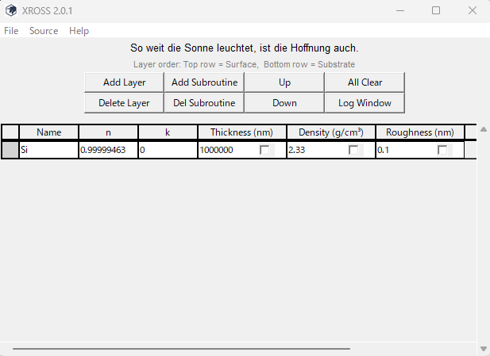
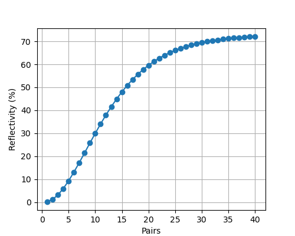
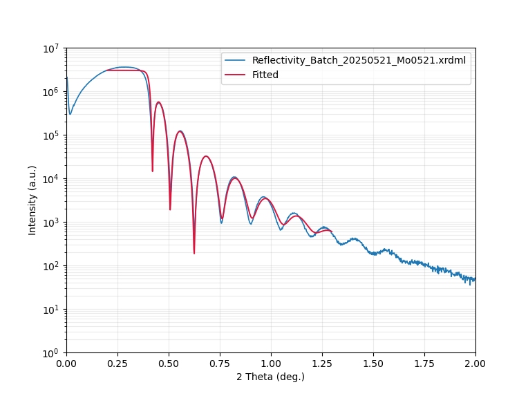
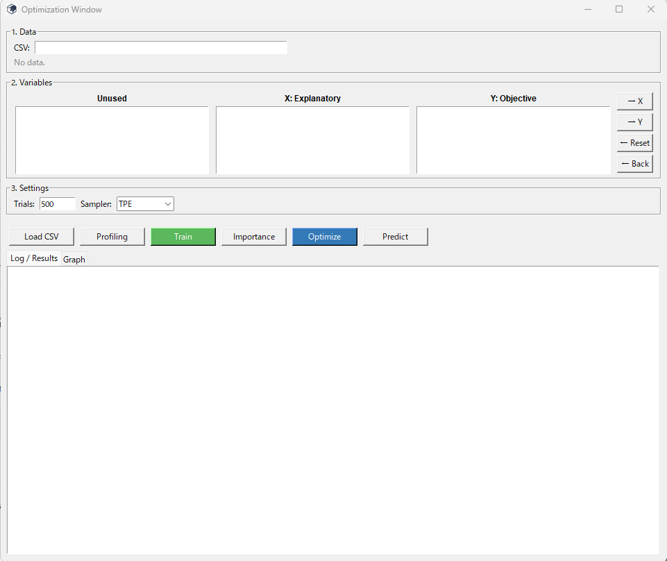
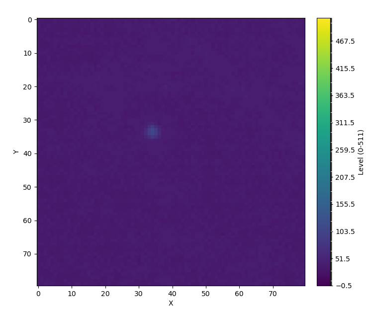

# XROSS - X-Ray Optics Simulation Software
The XROSS is completely free and open source software for X-ray optics. 

Please cite the follow when using the XROSS:  

    Naoki Hayase, "XROSS - X-Ray Optics Simulation Software," Submitted (2025).

## Installation

(1) "<> Code" from This page → "Download Zip"

(2) Install Python with Anaconda, and open Anaconda Prompt

(3) Type as follows;

    cd C:\Users\YOUR NAME\XROSS-main\XROSS-main

    python -m PyInstaller --noconfirm --distpath dist --workpath build_tmp build_exe\XROSS.spec

## Usage

### 1. Modelling 
Modelling a structure by "Layer" (a single layer) & "Subroutine" (a multilayer) on the main window.
You can save your model as csv files and load them.

### 2. EUV optics window 
Open EUV optics window from the source, and prepare your model on the main menu. 
Check-in only one checkbox, and click "Calculation".

### 3. XRR analysis window
Open XRR analysis window from the source, and prepare your model on the main menu.
Load measured file on the button from XRR analysis window, and click "Run".

### 4. Optimization window
Open XRR analysis window from the source.
You need to prepare a csv file which contain parameters with each names.
You just follow the window guide.

### 5. Image analyze window
Open XRR analysis window from the source, and upload an image file on Image analyze window.
Click "Confirm" button or image itself, you can see yellow square.
Click "Run" and you can get 512 tone heatmap in the square and its csv file.

